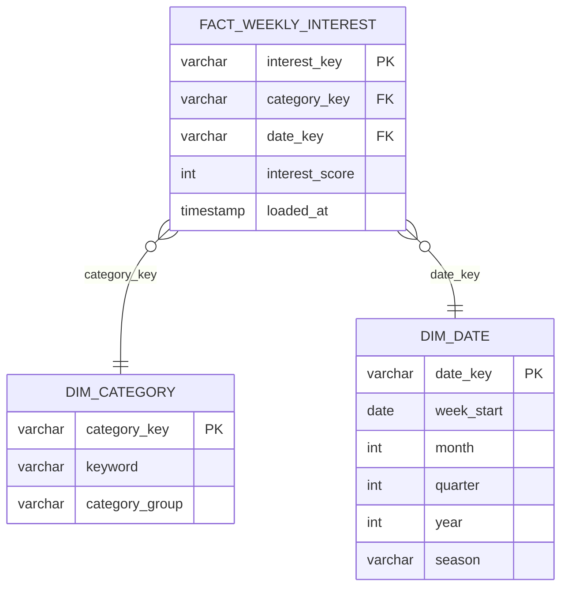
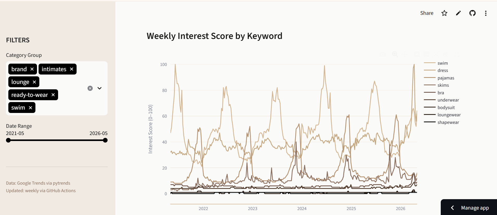

# SKIMS Product Performance Analytics

End-to-end demand analytics pipeline for SKIMS product categories. Pulls weekly Google Trends interest scores for 9 SKIMS-related keywords via the pytrends API, transforms the data through a dbt star schema in Snowflake, and surfaces category-level demand trends in a deployed Streamlit dashboard. A parallel knowledge base ingests scraped content from SKIMS.com and fashion press into Claude Code-curated wiki pages queryable in the final interview demo.

## Job Posting

- **Role:** Planning Analyst
- **Company:** SKIMS
- **Link:** https://app.careerpuck.com/job-board/SKIMS/job/446880

This project demonstrates the SQL, dimensional modeling, pipeline automation, and dashboard skills the role requires — built against real SKIMS product category data to show demand forecasting thinking directly relevant to the Planning Analyst scope.

## Tech Stack

| Layer | Tool |
|---|---|
| Source 1 | Google Trends via `pytrends` Python client |
| Source 2 | SKIMS.com + fashion press via Firecrawl web scrape |
| Data Warehouse | Snowflake (AWS US East 1) |
| Transformation | dbt (staging + mart star schema) |
| Orchestration | GitHub Actions (weekly schedule + manual trigger) |
| Dashboard | Streamlit (deployed to Streamlit Community Cloud) |
| Knowledge Base | Claude Code (scrape → summarize → query) |

## Pipeline Diagram

```mermaid
flowchart TB
    subgraph s1["Structured Data Path"]
        direction LR
        A["Google Trends\n(pytrends)"] -->|weekly keywords| B["GitHub Actions\n(Monday 6AM UTC)"]
        B --> C["Snowflake RAW\nGOOGLE_TRENDS_WEEKLY"]
        C --> D["dbt Staging\nstg_google_trends"]
        D --> E1["dim_category"]
        D --> E2["dim_date"]
        E1 --> F["fact_weekly_interest"]
        E2 --> F
        F --> G["Streamlit Dashboard\n(Streamlit Community Cloud)"]
    end

    subgraph s2["Knowledge Base Path"]
        direction LR
        H["SKIMS.com + Press\n(Firecrawl)"] -->|scraped markdown| I["GitHub Actions\n(Monday 6AM UTC)"]
        I --> J["knowledge/raw/\n15 sources"]
        J --> K["Claude Code"]
        K --> L["knowledge/wiki/\nindex · overview · categories · themes"]
    end
```

## ERD (Star Schema)

## Dashboard Preview

## Key Insights

**Descriptive (what happened?):** Shapewear drives the highest sustained demand of all SKIMS categories — consistently 2–3x the interest score of swim and loungewear, with a clear November peak every year.

**Diagnostic (why did it happen?):** Q4 shapewear spikes align with holiday gifting cycles, not individual campaigns — the pattern repeats identically across 5 years regardless of marketing activity, indicating structural seasonal demand.

**Recommendation:** Front-load shapewear inventory builds by October → capture full Q4 demand without stockouts during the highest-revenue window.

## Live Dashboard

https://fashion-planning-analyst.streamlit.app/

## Knowledge Base

A Claude Code-curated wiki built from 15 scraped sources across skims.com, vogue.com, wwd.com, forbes.com, whowhatwear.com, and harpersbazaar.com. Wiki pages live in `knowledge/wiki/`, raw sources in `knowledge/raw/`. Browse [`knowledge/index.md`](knowledge/index.md) to see all pages.

**Query it:** Open Claude Code in this repo and ask questions like:

- "What does my knowledge base say about SKIMS' shapewear strategy?"
- "Which SKIMS categories are most seasonal, and why?"
- "What does the press say about SKIMS' retail expansion plans?"

Claude Code reads the wiki pages first and falls back to raw sources when needed. See `CLAUDE.md` for the query conventions.

## Setup & Reproduction

**Requirements:** Python 3.12+, Snowflake trial account (AWS US East 1), Firecrawl API key

Copy `.env.example` to `.env` and fill in your credentials:

    SNOWFLAKE_ACCOUNT=
    SNOWFLAKE_USER=
    SNOWFLAKE_PASSWORD=
    SNOWFLAKE_DATABASE=SKIMS_ANALYTICS
    SNOWFLAKE_SCHEMA=RAW
    SNOWFLAKE_WAREHOUSE=COMPUTE_WH
    FIRECRAWL_API_KEY=

**Steps:**

1. Clone the repo and install dependencies: `pip install -r requirements.txt`
2. Run Source 1 extraction: `python pipeline/extract_trends.py`
3. Run Source 2 scrape: `python pipeline/extract_skims.py`
4. Run dbt: `cd dbt && dbt run --profiles-dir . && dbt test --profiles-dir .`
5. Run dashboard locally: `streamlit run dashboard/app.py`

## Repository Structure

    .
    ├── .github/workflows/        # GitHub Actions pipelines (Source 1 + Source 2)
    ├── pipeline/                 # Extraction scripts
    │   ├── extract_trends.py     # Source 1: pytrends → Snowflake RAW
    │   └── extract_skims.py      # Source 2: Firecrawl → knowledge/raw/
    ├── dbt/                      # dbt project (staging + mart models)
    │   └── models/
    │       ├── staging/          # stg_google_trends
    │       └── mart/             # dim_category, dim_date, fact_weekly_interest
    ├── dashboard/                # Streamlit app
    │   └── app.py
    ├── knowledge/                # Knowledge base
    │   ├── raw/                  # 15 scraped source files
    │   └── wiki/                 # Claude Code-generated wiki pages
    ├── docs/                     # Proposal, job posting, slides (PDF)
    ├── .env.example              # Required environment variables
    ├── .gitignore
    ├── CLAUDE.md                 # Project context + knowledge base query conventions
    └── README.md
