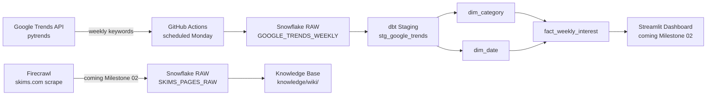

# SKIMS Product Performance Analytics

End-to-end demand analytics pipeline for SKIMS product categories. Tracks weekly Google Trends interest scores, transforms them through a dbt star schema in Snowflake, and surfaces insights in a Streamlit dashboard.

**Built for:** Planning Analyst role at SKIMS  
**Course:** ISBA 4715 — Analytics Engineering

## Pipeline

## Tech Stack

| Layer | Tool |
|---|---|
| Data Source | Google Trends via `pytrends` |
| Orchestration | GitHub Actions (weekly schedule) |
| Data Warehouse | Snowflake (AWS US East 1) |
| Transformation | dbt (staging + mart star schema) |
| Dashboard | Streamlit (Milestone 02) |

## Star Schema

**Fact:** `fact_weekly_interest` — interest score per keyword per week  
**Dims:** `dim_category` (keyword + category group), `dim_date` (week + month/quarter/year/season)

## Local Setup

1. Clone the repo
2. Install dependencies: `pip install -r requirements.txt`
3. Copy `.env.example` to `.env` and fill in your Snowflake credentials
4. Run extraction: `python pipeline/extract_trends.py`
5. Run dbt: `cd dbt && dbt run --profiles-dir . && dbt test --profiles-dir .`

## Credentials

All credentials stored as environment variables. Never committed to the repo.  
Required: `SNOWFLAKE_ACCOUNT`, `SNOWFLAKE_USER`, `SNOWFLAKE_PASSWORD`, `SNOWFLAKE_DATABASE`, `SNOWFLAKE_SCHEMA`, `SNOWFLAKE_WAREHOUSE`
