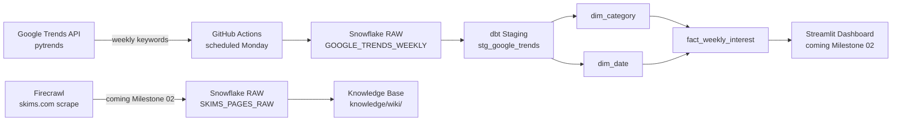

# Milestone 01 Implementation Plan

> **For agentic workers:** REQUIRED SUB-SKILL: Use superpowers:subagent-driven-development (recommended) or superpowers:executing-plans to implement this plan task-by-task. Steps use checkbox (`- [ ]`) syntax for tracking.

**Goal:** Extract Google Trends weekly interest data into Snowflake raw, transform through a dbt star schema, automate via GitHub Actions, and add a pipeline diagram to README.

**Architecture:** Two-stage pipeline — (1) `extract_trends.py` pulls pytrends data and truncate-reloads `RAW.GOOGLE_TRENDS_WEEKLY`; (2) dbt reads that raw table and builds staging + mart models in a `MART` schema. GitHub Actions runs both stages on a Monday schedule.

**Tech Stack:** Python 3.11, pytrends, snowflake-connector-python, pandas, dbt-snowflake 1.8, GitHub Actions, Snowflake (AWS US East 1)

---

## File Map

| File | Purpose |
|---|---|
| `requirements.txt` | Pinned Python dependencies |
| `pipeline/utils/snowflake_utils.py` | Shared Snowflake connection + first-run setup |
| `pipeline/extract_trends.py` | Source 1: pytrends → RAW.GOOGLE_TRENDS_WEEKLY |
| `dbt/dbt_project.yml` | dbt project config |
| `dbt/profiles.yml` | Snowflake connection (reads env vars) |
| `dbt/models/staging/schema.yml` | Source definition + staging model tests |
| `dbt/models/staging/stg_google_trends.sql` | Cleans/casts raw table |
| `dbt/models/mart/dim_category.sql` | One row per keyword with category group |
| `dbt/models/mart/dim_date.sql` | One row per week with month/quarter/year/season |
| `dbt/models/mart/fact_weekly_interest.sql` | Interest scores with FK to dimensions |
| `dbt/models/mart/schema.yml` | Mart model tests |
| `.github/workflows/extract_trends.yml` | Scheduled GitHub Actions pipeline |
| `README.md` | Project overview + Mermaid pipeline diagram |

---

## Task 1: Project scaffold + requirements.txt

**Files:**
- Create: `requirements.txt`
- Create: `pipeline/__init__.py`
- Create: `pipeline/utils/__init__.py`

- [ ] **Step 1: Create directory structure**

```bash
mkdir -p pipeline/utils
mkdir -p dbt/models/staging
mkdir -p dbt/models/mart
mkdir -p .github/workflows
touch pipeline/__init__.py
touch pipeline/utils/__init__.py
```

- [ ] **Step 2: Write requirements.txt**

```
pytrends==4.9.2
snowflake-connector-python==3.12.2
pandas==2.2.2
dbt-snowflake==1.8.2
python-dotenv==1.0.1
```

- [ ] **Step 3: Create and activate a virtual environment, install dependencies**

```bash
python -m venv .venv
source .venv/Scripts/activate   # Windows bash
pip install -r requirements.txt
```

Expected output ends with: `Successfully installed ...`

- [ ] **Step 4: Commit**

```bash
git add requirements.txt pipeline/__init__.py pipeline/utils/__init__.py
git commit -m "feat: add project scaffold and requirements"
```

---

## Task 2: Snowflake connection utility

**Files:**
- Create: `pipeline/utils/snowflake_utils.py`

- [ ] **Step 1: Write the file**

```python
import os
import snowflake.connector
from dotenv import load_dotenv

load_dotenv()


def setup_snowflake():
    """Creates database, schema, and warehouse on first run."""
    conn = snowflake.connector.connect(
        account=os.environ["SNOWFLAKE_ACCOUNT"],
        user=os.environ["SNOWFLAKE_USER"],
        password=os.environ["SNOWFLAKE_PASSWORD"],
    )
    cur = conn.cursor()
    db = os.environ["SNOWFLAKE_DATABASE"]
    schema = os.environ["SNOWFLAKE_SCHEMA"]
    wh = os.environ["SNOWFLAKE_WAREHOUSE"]
    cur.execute(f"CREATE DATABASE IF NOT EXISTS {db}")
    cur.execute(f"CREATE SCHEMA IF NOT EXISTS {db}.{schema}")
    cur.execute(f"CREATE SCHEMA IF NOT EXISTS {db}.MART")
    cur.execute(
        f"CREATE WAREHOUSE IF NOT EXISTS {wh} "
        f"WAREHOUSE_SIZE='X-SMALL' AUTO_SUSPEND=60 AUTO_RESUME=TRUE"
    )
    cur.close()
    conn.close()


def get_connection():
    return snowflake.connector.connect(
        account=os.environ["SNOWFLAKE_ACCOUNT"],
        user=os.environ["SNOWFLAKE_USER"],
        password=os.environ["SNOWFLAKE_PASSWORD"],
        database=os.environ["SNOWFLAKE_DATABASE"],
        schema=os.environ["SNOWFLAKE_SCHEMA"],
        warehouse=os.environ["SNOWFLAKE_WAREHOUSE"],
    )
```

- [ ] **Step 2: Verify it imports cleanly**

```bash
python -c "from pipeline.utils.snowflake_utils import get_connection, setup_snowflake; print('OK')"
```

Expected output: `OK`

- [ ] **Step 3: Commit**

```bash
git add pipeline/utils/snowflake_utils.py
git commit -m "feat: add Snowflake connection utility"
```

---

## Task 3: Write extract_trends.py

**Files:**
- Create: `pipeline/extract_trends.py`

- [ ] **Step 1: Write the file**

```python
import os
import sys
import time
from datetime import datetime, timezone

import pandas as pd
from dotenv import load_dotenv
from pytrends.request import TrendReq

sys.path.insert(0, os.path.dirname(os.path.dirname(__file__)))
from pipeline.utils.snowflake_utils import get_connection, setup_snowflake

load_dotenv()

KEYWORD_BATCHES = [
    ["shapewear", "bodysuit", "bra", "underwear", "dress"],
    ["skims", "loungewear", "pajamas", "swim"],
]

CREATE_TABLE_SQL = """
CREATE TABLE IF NOT EXISTS GOOGLE_TRENDS_WEEKLY (
    keyword        VARCHAR,
    week_start     DATE,
    interest_score INTEGER,
    loaded_at      TIMESTAMP_NTZ
)
"""


def fetch_batch(keywords: list) -> pd.DataFrame:
    pytrends = TrendReq(hl="en-US", tz=360)
    pytrends.build_payload(keywords, timeframe="today 5-y", geo="US")
    df = pytrends.interest_over_time()
    if df.empty:
        return pd.DataFrame()
    df = df.drop(columns=["isPartial"], errors="ignore")
    df = df.reset_index()
    df = df.melt(id_vars=["date"], var_name="keyword", value_name="interest_score")
    df = df.rename(columns={"date": "week_start"})
    df["week_start"] = df["week_start"].dt.date
    df["interest_score"] = df["interest_score"].astype(int)
    return df


def load_to_snowflake(conn, df: pd.DataFrame) -> int:
    loaded_at = datetime.now(timezone.utc)
    rows = [
        (row["keyword"], str(row["week_start"]), int(row["interest_score"]), loaded_at)
        for _, row in df.iterrows()
    ]
    cur = conn.cursor()
    cur.executemany(
        "INSERT INTO GOOGLE_TRENDS_WEEKLY (keyword, week_start, interest_score, loaded_at) "
        "VALUES (%s, %s, %s, %s)",
        rows,
    )
    cur.close()
    return len(rows)


def main():
    print("Setting up Snowflake infrastructure...")
    setup_snowflake()

    conn = get_connection()
    cur = conn.cursor()
    cur.execute(CREATE_TABLE_SQL)
    cur.execute("TRUNCATE TABLE IF EXISTS GOOGLE_TRENDS_WEEKLY")
    cur.close()

    all_frames = []
    for batch in KEYWORD_BATCHES:
        print(f"Fetching: {batch}")
        df = fetch_batch(batch)
        if not df.empty:
            all_frames.append(df)
        time.sleep(5)  # avoid pytrends rate limit

    if not all_frames:
        print("ERROR: No data returned from pytrends.")
        sys.exit(1)

    combined = pd.concat(all_frames, ignore_index=True)
    print(f"Loading {len(combined)} rows to Snowflake...")
    nrows = load_to_snowflake(conn, combined)
    conn.close()
    print(f"Done. Loaded {nrows} rows.")


if __name__ == "__main__":
    main()
```

- [ ] **Step 2: Commit**

```bash
git add pipeline/extract_trends.py
git commit -m "feat: add Google Trends extraction script"
```

---

## Task 4: Run extraction locally — verify rows in Snowflake

**Files:** none (run only)

- [ ] **Step 1: Run the script**

```bash
python pipeline/extract_trends.py
```

Expected output (takes ~30s due to sleep between batches):
```
Setting up Snowflake infrastructure...
Fetching: ['shapewear', 'bodysuit', 'bra', 'underwear', 'dress']
Fetching: ['skims', 'loungewear', 'pajamas', 'swim']
Loading 2340 rows to Snowflake...
Done. Loaded 2340 rows.
```
(Row count may vary slightly by 0–10 rows depending on pytrends partial-week handling.)

- [ ] **Step 2: Verify rows in Snowflake**

Log in to app.snowflake.com → Worksheets → run:

```sql
SELECT keyword, COUNT(*) as weeks
FROM SKIMS_ANALYTICS.RAW.GOOGLE_TRENDS_WEEKLY
GROUP BY keyword
ORDER BY keyword;
```

Expected: 9 rows (one per keyword), each with ~260 weeks.

- [ ] **Step 3: Commit (no code change — just confirm success before moving on)**

```bash
git commit --allow-empty -m "chore: verified extraction loads to Snowflake raw"
```

---

## Task 5: dbt project setup

**Files:**
- Create: `dbt/dbt_project.yml`
- Create: `dbt/profiles.yml`

- [ ] **Step 1: Write dbt_project.yml**

```yaml
name: skims_analytics
version: "1.0.0"
config-version: 2

profile: skims_analytics

model-paths: ["models"]
test-paths: ["tests"]
clean-targets: ["target", "dbt_packages"]

models:
  skims_analytics:
    staging:
      +materialized: view
    mart:
      +materialized: table
```

- [ ] **Step 2: Write profiles.yml**

```yaml
skims_analytics:
  target: dev
  outputs:
    dev:
      type: snowflake
      account: "{{ env_var('SNOWFLAKE_ACCOUNT') }}"
      user: "{{ env_var('SNOWFLAKE_USER') }}"
      password: "{{ env_var('SNOWFLAKE_PASSWORD') }}"
      database: "{{ env_var('SNOWFLAKE_DATABASE') }}"
      schema: MART
      warehouse: "{{ env_var('SNOWFLAKE_WAREHOUSE') }}"
      role: ACCOUNTADMIN
      threads: 1
```

Note: `schema: MART` means dbt writes all models to `SKIMS_ANALYTICS.MART`. The raw source is defined separately in schema.yml pointing to `RAW`.

- [ ] **Step 3: Load env vars and test the dbt connection**

```bash
export $(grep -v '^#' .env | xargs)
cd dbt && dbt debug --profiles-dir .
```

Expected: `All checks passed!`

- [ ] **Step 4: Commit**

```bash
cd ..
git add dbt/dbt_project.yml dbt/profiles.yml
git commit -m "feat: initialize dbt project with Snowflake profile"
```

---

## Task 6: dbt staging model

**Files:**
- Create: `dbt/models/staging/schema.yml`
- Create: `dbt/models/staging/stg_google_trends.sql`

- [ ] **Step 1: Write schema.yml (source definition + tests)**

```yaml
version: 2

sources:
  - name: raw
    database: SKIMS_ANALYTICS
    schema: RAW
    tables:
      - name: GOOGLE_TRENDS_WEEKLY

models:
  - name: stg_google_trends
    description: "Cleaned Google Trends weekly interest data"
    columns:
      - name: keyword
        tests:
          - not_null
      - name: week_start
        tests:
          - not_null
      - name: interest_score
        tests:
          - not_null
```

- [ ] **Step 2: Write stg_google_trends.sql**

```sql
with source as (
    select * from {{ source('raw', 'GOOGLE_TRENDS_WEEKLY') }}
)

select
    keyword,
    week_start::date    as week_start,
    interest_score::int as interest_score,
    loaded_at
from source
```

- [ ] **Step 3: Run just this model to verify (run from project root)**

```bash
export $(grep -v '^#' .env | xargs)
cd dbt && dbt run --select stg_google_trends --profiles-dir .
```

Expected: `1 of 1 OK created sql view model MART.stg_google_trends`

- [ ] **Step 4: Commit (back in project root)**

```bash
cd ..
git add dbt/models/staging/
git commit -m "feat: add dbt staging model for Google Trends"
```

---

## Task 7: dbt dimension tables

**Files:**
- Create: `dbt/models/mart/dim_category.sql`
- Create: `dbt/models/mart/dim_date.sql`

- [ ] **Step 1: Write dim_category.sql**

```sql
with keywords as (
    select distinct keyword from {{ ref('stg_google_trends') }}
),

categorized as (
    select
        md5(keyword)  as category_key,
        keyword,
        case keyword
            when 'shapewear'  then 'intimates'
            when 'bodysuit'   then 'intimates'
            when 'bra'        then 'intimates'
            when 'underwear'  then 'intimates'
            when 'skims'      then 'brand'
            when 'dress'      then 'ready-to-wear'
            when 'loungewear' then 'lounge'
            when 'pajamas'    then 'lounge'
            when 'swim'       then 'swim'
            else 'other'
        end as category_group
    from keywords
)

select * from categorized
```

- [ ] **Step 2: Write dim_date.sql**

```sql
with dates as (
    select distinct week_start from {{ ref('stg_google_trends') }}
),

date_dim as (
    select
        md5(week_start::varchar)      as date_key,
        week_start,
        month(week_start)             as month,
        quarter(week_start)           as quarter,
        year(week_start)              as year,
        case
            when month(week_start) in (12, 1, 2)  then 'Winter'
            when month(week_start) in (3, 4, 5)   then 'Spring'
            when month(week_start) in (6, 7, 8)   then 'Summer'
            when month(week_start) in (9, 10, 11) then 'Fall'
        end as season
    from dates
)

select * from date_dim
```

- [ ] **Step 3: Run both dimension models (from project root)**

```bash
export $(grep -v '^#' .env | xargs)
cd dbt && dbt run --select dim_category dim_date --profiles-dir .
```

Expected:
```
1 of 2 OK created sql table model MART.dim_category
2 of 2 OK created sql table model MART.dim_date
```

- [ ] **Step 4: Commit**

```bash
cd ..
git add dbt/models/mart/dim_category.sql dbt/models/mart/dim_date.sql
git commit -m "feat: add dim_category and dim_date dbt models"
```

---

## Task 8: dbt fact table + mart schema tests

**Files:**
- Create: `dbt/models/mart/fact_weekly_interest.sql`
- Create: `dbt/models/mart/schema.yml`

- [ ] **Step 1: Write fact_weekly_interest.sql**

```sql
with stg as (
    select * from {{ ref('stg_google_trends') }}
),

dim_cat as (
    select * from {{ ref('dim_category') }}
),

dim_dt as (
    select * from {{ ref('dim_date') }}
),

fact as (
    select
        md5(stg.keyword || '|' || stg.week_start::varchar) as interest_key,
        dim_cat.category_key,
        dim_dt.date_key,
        stg.interest_score,
        stg.loaded_at
    from stg
    left join dim_cat on stg.keyword = dim_cat.keyword
    left join dim_dt  on stg.week_start = dim_dt.week_start
)

select * from fact
```

- [ ] **Step 2: Write mart/schema.yml**

```yaml
version: 2

models:
  - name: dim_category
    description: "SKIMS product categories with group classification"
    columns:
      - name: category_key
        tests:
          - unique
          - not_null
      - name: keyword
        tests:
          - not_null

  - name: dim_date
    description: "Date dimension by week"
    columns:
      - name: date_key
        tests:
          - unique
          - not_null
      - name: week_start
        tests:
          - not_null

  - name: fact_weekly_interest
    description: "Weekly Google Trends interest scores for SKIMS-related keywords"
    columns:
      - name: interest_key
        tests:
          - unique
          - not_null
      - name: category_key
        tests:
          - not_null
      - name: date_key
        tests:
          - not_null
      - name: interest_score
        tests:
          - not_null
```

- [ ] **Step 3: Commit**

```bash
git add dbt/models/mart/fact_weekly_interest.sql dbt/models/mart/schema.yml
git commit -m "feat: add fact_weekly_interest and mart schema tests"
```

---

## Task 9: Run full dbt pipeline locally

**Files:** none (run only)

- [ ] **Step 1: Run all models (from project root)**

```bash
export $(grep -v '^#' .env | xargs)
cd dbt && dbt run --profiles-dir .
```

Expected:
```
1 of 4 OK created sql view  model MART.stg_google_trends
2 of 4 OK created sql table model MART.dim_category
3 of 4 OK created sql table model MART.dim_date
4 of 4 OK created sql table model MART.fact_weekly_interest
Completed successfully
```

- [ ] **Step 2: Run all tests (still inside dbt/)**

```bash
dbt test --profiles-dir .
```

Expected: all tests pass with `PASS` for each column test. Zero failures.

If a test fails, check: (a) fact rows join correctly to both dims, (b) no duplicate interest_key values in the fact table.

- [ ] **Step 3: Verify row counts in Snowflake**

Log in to app.snowflake.com → run:

```sql
SELECT 'dim_category'         as model, COUNT(*) as rows FROM SKIMS_ANALYTICS.MART.dim_category
UNION ALL
SELECT 'dim_date'             as model, COUNT(*) as rows FROM SKIMS_ANALYTICS.MART.dim_date
UNION ALL
SELECT 'fact_weekly_interest' as model, COUNT(*) as rows FROM SKIMS_ANALYTICS.MART.fact_weekly_interest;
```

Expected:
- `dim_category`: 9 rows
- `dim_date`: ~260 rows
- `fact_weekly_interest`: ~2340 rows

- [ ] **Step 4: Commit**

```bash
cd ..
git commit --allow-empty -m "chore: verified full dbt run and tests pass locally"
```

---

## Task 10: GitHub Actions pipeline + Secrets

**Files:**
- Create: `.github/workflows/extract_trends.yml`

- [ ] **Step 1: Write the workflow file**

```yaml
name: Extract Google Trends

on:
  schedule:
    - cron: "0 6 * * 1"   # every Monday at 6 AM UTC
  workflow_dispatch:        # allow manual trigger

jobs:
  extract-and-transform:
    runs-on: ubuntu-latest

    steps:
      - name: Checkout repo
        uses: actions/checkout@v4

      - name: Set up Python 3.11
        uses: actions/setup-python@v5
        with:
          python-version: "3.11"

      - name: Install dependencies
        run: pip install -r requirements.txt

      - name: Extract Google Trends to Snowflake
        env:
          SNOWFLAKE_ACCOUNT:    ${{ secrets.SNOWFLAKE_ACCOUNT }}
          SNOWFLAKE_USER:       ${{ secrets.SNOWFLAKE_USER }}
          SNOWFLAKE_PASSWORD:   ${{ secrets.SNOWFLAKE_PASSWORD }}
          SNOWFLAKE_DATABASE:   ${{ secrets.SNOWFLAKE_DATABASE }}
          SNOWFLAKE_SCHEMA:     ${{ secrets.SNOWFLAKE_SCHEMA }}
          SNOWFLAKE_WAREHOUSE:  ${{ secrets.SNOWFLAKE_WAREHOUSE }}
        run: python pipeline/extract_trends.py

      - name: Run dbt
        env:
          SNOWFLAKE_ACCOUNT:    ${{ secrets.SNOWFLAKE_ACCOUNT }}
          SNOWFLAKE_USER:       ${{ secrets.SNOWFLAKE_USER }}
          SNOWFLAKE_PASSWORD:   ${{ secrets.SNOWFLAKE_PASSWORD }}
          SNOWFLAKE_DATABASE:   ${{ secrets.SNOWFLAKE_DATABASE }}
          SNOWFLAKE_WAREHOUSE:  ${{ secrets.SNOWFLAKE_WAREHOUSE }}
        run: |
          cd dbt
          dbt run --profiles-dir .
          dbt test --profiles-dir .
```

- [ ] **Step 2: Commit and push the workflow**

```bash
git add .github/workflows/extract_trends.yml
git commit -m "feat: add GitHub Actions pipeline for Google Trends extraction"
git push origin main
```

- [ ] **Step 3: Add GitHub Secrets**

Go to your repo on GitHub → Settings → Secrets and variables → Actions → New repository secret. Add each of these:

| Secret name | Value |
|---|---|
| `SNOWFLAKE_ACCOUNT` | `NBFBALO-FIC47143` |
| `SNOWFLAKE_USER` | your Snowflake username |
| `SNOWFLAKE_PASSWORD` | your Snowflake password |
| `SNOWFLAKE_DATABASE` | `SKIMS_ANALYTICS` |
| `SNOWFLAKE_SCHEMA` | `RAW` |
| `SNOWFLAKE_WAREHOUSE` | `COMPUTE_WH` |

- [ ] **Step 4: Trigger a manual run to confirm it works**

GitHub repo → Actions tab → "Extract Google Trends" → Run workflow → Run workflow.

Expected: green checkmark on both steps (extract + dbt). If it fails, click the failed step to read the logs.

---

## Task 11: README with pipeline diagram

**Files:**
- Create: `README.md`

- [ ] **Step 1: Write README.md**

```markdown
# SKIMS Product Performance Analytics

End-to-end demand analytics pipeline for SKIMS product categories. Tracks weekly Google Trends interest scores, transforms them through a dbt star schema in Snowflake, and (coming soon) surfaces insights in a Streamlit dashboard.

**Built for:** Planning Analyst role at SKIMS  
**Course:** ISBA 4715 — Analytics Engineering

## Pipeline



## Tech Stack

| Layer | Tool |
|---|---|
| Data Source | Google Trends via `pytrends` |
| Orchestration | GitHub Actions (weekly schedule) |
| Data Warehouse | Snowflake (AWS US East 1) |
| Transformation | dbt (staging + mart star schema) |
| Dashboard | Streamlit (Milestone 02) |

## Star Schema

**Fact:** `fact_weekly_interest` — interest score per keyword per week  
**Dims:** `dim_category` (keyword + category group), `dim_date` (week + month/quarter/year/season)

## Local Setup

1. Clone the repo
2. Create a virtual environment: `python -m venv .venv && source .venv/Scripts/activate`
3. Install dependencies: `pip install -r requirements.txt`
4. Copy `.env.example` to `.env` and fill in your Snowflake credentials
5. Run extraction: `python pipeline/extract_trends.py`
6. Run dbt: `cd dbt && export $(grep -v '^#' ../.env | xargs) && dbt run --profiles-dir . && dbt test --profiles-dir .`

## Credentials

All credentials stored as environment variables. Never committed to the repo.  
Required variables: `SNOWFLAKE_ACCOUNT`, `SNOWFLAKE_USER`, `SNOWFLAKE_PASSWORD`, `SNOWFLAKE_DATABASE`, `SNOWFLAKE_SCHEMA`, `SNOWFLAKE_WAREHOUSE`
```

- [ ] **Step 2: Create .env.example (safe to commit — no real values)**

```bash
cat > .env.example << 'EOF'
SNOWFLAKE_ACCOUNT=your_account_identifier
SNOWFLAKE_USER=your_username
SNOWFLAKE_PASSWORD=your_password
SNOWFLAKE_DATABASE=SKIMS_ANALYTICS
SNOWFLAKE_SCHEMA=RAW
SNOWFLAKE_WAREHOUSE=COMPUTE_WH
FIRECRAWL_API_KEY=your_firecrawl_key
EOF
```

- [ ] **Step 3: Commit and push**

```bash
git add README.md .env.example
git commit -m "docs: add README with pipeline diagram and setup instructions"
git push origin main
```

---

## Task 12: Final verification + submit

- [ ] **Step 1: Confirm repo is public**

GitHub repo → Settings → scroll to "Danger Zone" → confirm visibility is Public.

- [ ] **Step 2: Confirm .env is NOT committed**

```bash
git ls-files | grep .env
```

Expected output: only `.env.example` appears. If `.env` appears, immediately run `git rm --cached .env && git commit -m "chore: remove .env from tracking"`.

- [ ] **Step 3: Confirm GitHub Actions ran successfully**

GitHub repo → Actions → most recent run → both steps green.

- [ ] **Step 4: Submit to Brightspace**

Submit repo URL: `https://github.com/Sydneyransel/fashion-planning-analyst`
